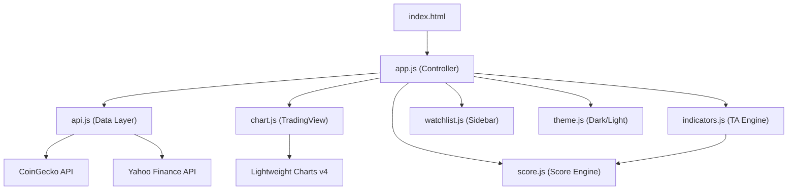

# Investment Analyzer — Walkthrough

## What Was Built

A **professional-grade investment analysis dashboard** that provides real-time technical analysis with an aggregated **Investment Score** (0-100) for Crypto, US/Thai Stocks, and Commodities.


---

## Architecture



---

## Files Created

All files are located in [investment-analyzer/](file:///Users/toptee/Library/CloudStorage/OneDrive-Personal/TOPSIRA/1_Project/Git_Repo(TOP)/projects/experiments/investment-analyzer):

### Core Files
| File | Purpose |
|------|---------|
| [index.html](file:///Users/toptee/Library/CloudStorage/OneDrive-Personal/TOPSIRA/1_Project/Git_Repo(TOP)/projects/experiments/investment-analyzer/index.html) | Main HTML — semantic structure with dashboard layout |
| [css/styles.css](file:///Users/toptee/Library/CloudStorage/OneDrive-Personal/TOPSIRA/1_Project/Git_Repo(TOP)/projects/experiments/investment-analyzer/css/styles.css) | Complete design system — 700+ lines, dark/light themes, glassmorphism, responsive |
| [js/app.js](file:///Users/toptee/Library/CloudStorage/OneDrive-Personal/TOPSIRA/1_Project/Git_Repo(TOP)/projects/experiments/investment-analyzer/js/app.js) | Main controller — orchestrates all modules, handles events |

### Data & Logic
| File | Purpose |
|------|---------|
| [js/api.js](file:///Users/toptee/Library/CloudStorage/OneDrive-Personal/TOPSIRA/1_Project/Git_Repo(TOP)/projects/experiments/investment-analyzer/js/api.js) | Unified data API — CoinGecko + Yahoo Finance with CORS proxy fallback |
| [js/indicators.js](file:///Users/toptee/Library/CloudStorage/OneDrive-Personal/TOPSIRA/1_Project/Git_Repo(TOP)/projects/experiments/investment-analyzer/js/indicators.js) | Technical indicators — RSI, MACD, SMA/EMA, Bollinger Bands, Volume |
| [js/score.js](file:///Users/toptee/Library/CloudStorage/OneDrive-Personal/TOPSIRA/1_Project/Git_Repo(TOP)/projects/experiments/investment-analyzer/js/score.js) | Investment Score engine — weighted 0-100 aggregation |

### UI Components
| File | Purpose |
|------|---------|
| [js/chart.js](file:///Users/toptee/Library/CloudStorage/OneDrive-Personal/TOPSIRA/1_Project/Git_Repo(TOP)/projects/experiments/investment-analyzer/js/chart.js) | TradingView Lightweight Charts wrapper — candlesticks + overlays |
| [js/watchlist.js](file:///Users/toptee/Library/CloudStorage/OneDrive-Personal/TOPSIRA/1_Project/Git_Repo(TOP)/projects/experiments/investment-analyzer/js/watchlist.js) | Watchlist manager — add/remove, localStorage persistence |
| [js/theme.js](file:///Users/toptee/Library/CloudStorage/OneDrive-Personal/TOPSIRA/1_Project/Git_Repo(TOP)/projects/experiments/investment-analyzer/js/theme.js) | Theme toggle — dark/light with chart color adaptation |

### Assets & Docs
| File | Purpose |
|------|---------|
| [assets/favicon.svg](file:///Users/toptee/Library/CloudStorage/OneDrive-Personal/TOPSIRA/1_Project/Git_Repo(TOP)/projects/experiments/investment-analyzer/assets/favicon.svg) | App icon — gradient chart line |
| [README.md](file:///Users/toptee/Library/CloudStorage/OneDrive-Personal/TOPSIRA/1_Project/Git_Repo(TOP)/projects/experiments/investment-analyzer/README.md) | Project documentation |

---

## Key Features

### 1. Multi-Asset Support (30+ assets)
- **Crypto**: BTC, ETH, SOL, BNB, XRP, ADA, DOGE, DOT, AVAX, LINK
- **US Stocks**: AAPL, MSFT, GOOGL, AMZN, TSLA, NVDA, META
- **Thai Stocks**: PTT, SCC, ADVANC, CPALL, KBANK
- **Commodities**: Gold, Silver, Crude Oil

### 2. Technical Analysis Indicators
- **RSI** (14-period) — Overbought/Oversold detection
- **MACD** (12/26/9) — Momentum & trend reversals with histogram
- **SMA** (20/50/200) — Short/medium/long term trend with Golden/Death Cross
- **Bollinger Bands** (20, 2σ) — Volatility and price position
- **Volume Analysis** — Volume vs 20-period SMA comparison

### 3. Investment Score (0-100)
Weighted aggregation: MA (25%) + RSI (20%) + MACD (20%) + Volume (20%) + BB (15%)

| Score | Label | Color |
|-------|-------|-------|
| 80-100 | Strong Buy | 🟢 Bright Green |
| 60-79 | Buy | 🟢 Green |
| 40-59 | Hold | 🟡 Yellow |
| 20-39 | Sell | 🟠 Orange |
| 0-19 | Strong Sell | 🔴 Red |

### 4. Interactive Dashboard
- Professional candlestick charts with synchronized volume
- 6 timeframes: 1D, 7D, 1M, 3M, 6M, 1Y
- Dark/Light theme toggle (Bloomberg Terminal aesthetic)
- Customizable watchlist with localStorage persistence
- Search to add any asset from the registry
- Auto-refresh every 60 seconds
- Responsive: Desktop → Tablet → Mobile

---

## Bug Fixes Applied During Verification

| Bug | Root Cause | Fix |
|-----|-----------|-----|
| SMA 200 ghost line at chart bottom | SMA 200 calculated from insufficient data (30 points for 1M) | Only compute SMA when `data.length >= period` |
| Volume "?x avg" | `volumeRatio` was NaN for zero-volume data | Added `isFinite()` check with fallback to 1.00 |
| MA Trend "bullish (Death Cross)" | Death Cross detection didn't override conflicting trend signal | Cross signal now forces score to bearish range; detail uses final signal |
| Timeframe switch blocked during loading | `if (isLoading) return` rejected new requests | Replaced with `requestId` pattern for proper race condition handling |

---

## How to Use

### Run Locally
The server is already running at **http://localhost:8765**. Just open it in your browser!

To restart later:
```bash
cd projects/experiments/investment-analyzer
npx serve . -p 8765
```

Or simply open `index.html` directly in a browser.

### Using the Dashboard
1. **Select an asset** from the sidebar watchlist (BTC, ETH, AAPL, GOLD by default)
2. **Change timeframe** using the period buttons (1D/7D/1M/3M/6M/1Y)
3. **Add assets** using the search box — type a symbol or name
4. **Toggle theme** using the sun/moon button in the header
5. **Read the Investment Score** and individual indicator panels below the chart

---

## Deploy to GitHub Pages

> [!IMPORTANT]
> To deploy at `topsira.github.io/investment-analyzer`, follow these steps:

```bash
# Navigate to the project
cd projects/experiments/investment-analyzer

# Initialize a new git repo
git init
git add .
git commit -m "feat: Investment Analyzer dashboard with technical analysis"

# Create the remote repo on GitHub (if using gh CLI)
gh repo create investment-analyzer --public --source=. --remote=origin

# Or manually add remote:
git remote add origin https://github.com/topsira/investment-analyzer.git
git branch -M main
git push -u origin main
```

Then in the GitHub repo → **Settings** → **Pages** → Set Source to `main` branch, root `/` → Save.

Your app will be live at: **https://topsira.github.io/investment-analyzer/**

---

## Testing Summary

| Test | Result |
|------|--------|
| UI renders correctly (dark theme) | ✅ |
| CoinGecko API (BTC, ETH data) | ✅ |
| Yahoo Finance API (AAPL, GOLD data) | ✅ |
| Candlestick chart rendering | ✅ |
| Volume chart rendering | ✅ |
| SMA overlay lines (20, 50) | ✅ |
| SMA 200 hidden when insufficient data | ✅ |
| Investment Score gauge animation | ✅ |
| Indicator cards display values | ✅ |
| Watchlist sidebar with prices | ✅ |
| Theme toggle (dark ↔ light) | ✅ |
| Search and add assets | ✅ |
| Timeframe switching | ✅ |
| Responsive layout | ✅ (verified via code) |
